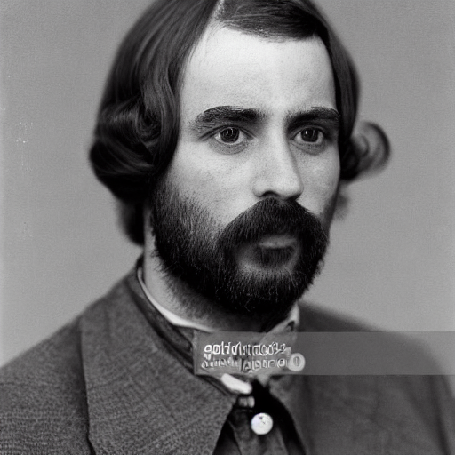

- This project presents a comparative analysis between two state-of-the-art generative image models—Stable Diffusion and Conditional DC-GANs (cDC-GANs)—across two datasets: CelebA and CIFAR-10. 
- Our goal was to evaluate how well each model performs in terms of perceptual quality, attribute fidelity, prompt control, and downstream machine learning utility.
- We found that Stable Diffusion consistently outperformed all cDC-GAN variants in perceptual quality and semantic diversity. Furthermore, Adam + BCE was the most reliable cDC-GAN setup across both datasets. RMSProp + Hinge performed the worst, often producing unstable or unrecognizable outputs.
- Conditioning with natural language (Stable Diffusion) offers strong prompt-level control but depends on semantic richness of prompts, while GANs showed better label controllability and classification utility in structured, low-resolution datasets like CIFAR-10.

