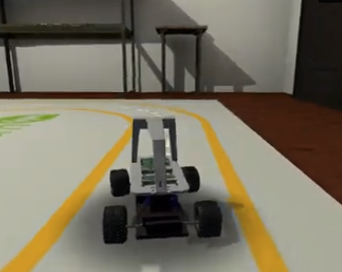

- The goal of this project is to train a Reinforcement Learning (RL) Classifier on autonomous vehicles. We used both CARLA and DonkeyCar Simulator to navigate our vehicle. 
- CARLA provided a complex urban driving environment, while the DonkeyCar simulator will be used for a simpler track-based navigation on multiple tracks, including UCSD's own “Warren Field” circuit. 
- We relied on a Lidar sensor for data collection because of its robustness in capturing depth information and obstacle detection regardless of lighting conditions, an advantage over typical computer vision based data collection. 
- We implemented two deep RL algorithms: Actor-Critic and Proximal Policy Optimization (PPO), both designed for continuous action spaces since algorithms like simple a simple Q learning to are ineffective for problems in continious action spaces.

