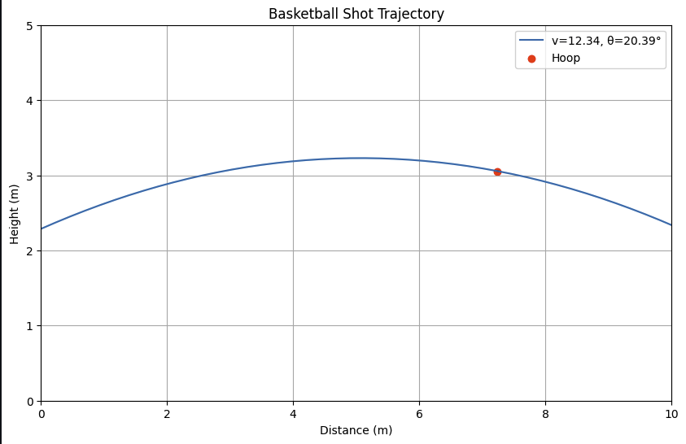

- LukaBot is a reinforcement learning (RL) project that simulates a basketball shooting scenario inspired by NBA player Luka Dončić. The goal is to train an RL agent to shoot a basketball from the 3-point line (7.24 meters from the hoop) and successfully make shots into a hoop at a height of 3.05 meters (10 ft - standard NBA hoop height). 
- The environment is built using the Gym interface, and the agent is trained using the Soft Actor-Critic (SAC) algorithm from Stable Baselines3.
- 